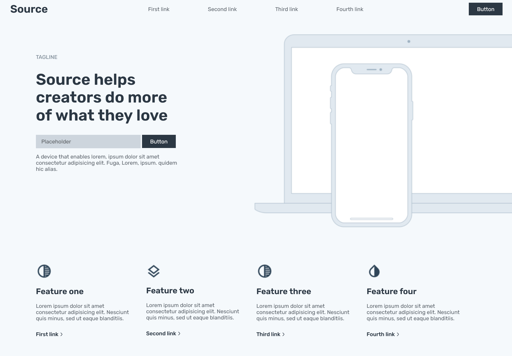
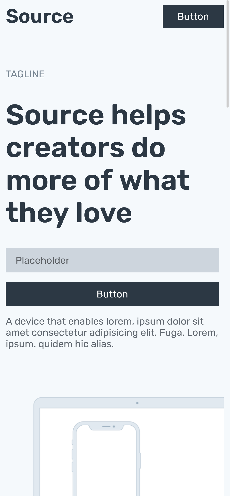

# Source-Layout

This repository contains code for the source-layout build using HTML and CSS. I have build this as a part of HW for class 08 of #100Devs.

## Here's link to the wireframe -
https://dribbble.com/shots/8718928-Source-Wireframes

# Screenshots -

